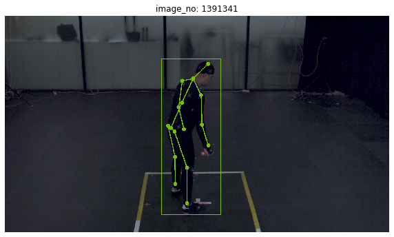

# SweetDataset
2D and 3D Human pose dataset

HumanPoseDataset은 사람 동작 영상에 따른 관절좌표(key points)로 구성되어 있습니다. 데이터는 20만장 영상클립과 이에 해당하는 관절좌표로 구성되어 있습니다. 예시 이미지는 아래와 같습니다.

## 데이터 다운로드
HumanPoseData는 [aihub.or.kr](http://www.aihub.or.kr/content/608) 의 사람 동작 영상 AI 데이터에서 이용이 가능합니다.

## Acknowledgements
This repo is largely modified from repo of [Mask_RCNN](https://github.com/matterport/Mask_RCNN.git)